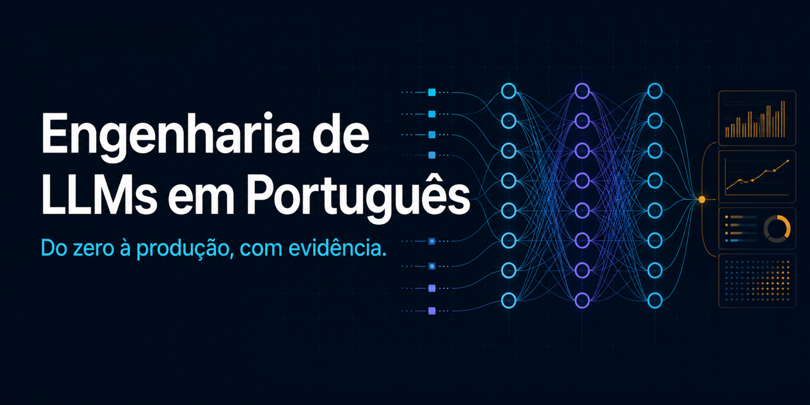

# 🧠 Engenharia e Customização de LLMs em Português



[](https://github.com/lucianoon/llm-course/actions/workflows/ci.yml)
[](pyproject.toml)
[](LICENSE)
[](#status-do-projeto)

Um curso aberto para entender, customizar, avaliar e servir modelos de linguagem —
**construído de baixo para cima, em português, com laboratórios que tornam as hipóteses
mensuráveis**.

Não é necessário concluir tudo. Há uma rota curta para engenharia, uma fase para quem nunca
programou e especializações em fine-tuning, RL, RAG, agentes, interpretabilidade e sistemas.

> **Fase 0 + 19 módulos · trilha de pesquisa em 3 etapas · 35 scripts de laboratório**
>
> Fundamentos rodam em **CPU**. Customização com modelos reais tem rotas para
> **Mac Apple Silicon (MLX)** e **GPU NVIDIA (CUDA)**.

Rotas prontas: [essencial](TRILHA-ESSENCIAL.md) · [customização intensiva em 12 semanas](TRILHA-CERTIFICACAO-12-SEMANAS.md) · [GPU NVIDIA/CUDA](00-setup-gpu.md) · [governança de dados](GOVERNANCA-DE-DADOS.md).

> 🌱 **Nunca programou?** Comece pela [Fase 0 — ponte para iniciantes](00-iniciante-zero/)
> e siga somente a [trilha essencial do zero ao primeiro nível profissional](TRILHA-ESSENCIAL.md).
> Ela apresenta os pré-requisitos, mas pode precisar ser acompanhada por prática adicional de
> Python e terminal. Você não precisa concluir todos os temas avançados para começar a trabalhar bem.

---

## Experimente em 10 minutos

O primeiro laboratório não baixa modelos e percorre o ciclo usado no curso inteiro:
entrada → transformação → previsão → avaliação.

```bash
git clone https://github.com/lucianoon/llm-course.git
cd llm-course
uv sync --extra dev --extra test --locked
uv run python 00-iniciante-zero/lab.py
uv run python -m pytest
```

Depois, escolha a [trilha essencial](TRILHA-ESSENCIAL.md) ou abra o
[mapa completo](#o-mapa-completo). Para entender antes de instalar, leia a
[Fase 0](00-iniciante-zero/) diretamente no GitHub.

## O que você vai construir

- componentes de um transformer e mecanismos de atenção, do zero;
- pipelines de dados, SFT, LoRA/QLoRA, DPO, GRPO e distillation;
- avaliações com baselines, intervalos de confiança e leitura manual de saídas;
- sistemas com RAG, ferramentas, controle de custo, observabilidade e rollback;
- um [projeto final reproduzível](modulo-12-projeto/) com contrato de entrega.

---

## Dois cursos num só repositório

Este material não escolhe entre academia e mercado — porque a mesma base serve às duas. A distinção é **o que você pretende fazer com isso**, e há uma rota clara para cada uma:

| Trilha | Meta | Para quem | Onde está |
|---|---|---|---|
| **Engenharia (mercado)** | Colocar sistemas de LLM de pé, medidos e protegidos | Quem quer o primeiro nível profissional e entregar de verdade | [trilha essencial](TRILHA-ESSENCIAL.md) → [módulo 19](modulo-19-producao/) |
| **Pesquisa (academia)** | Reproduzir, questionar e estender o estado da arte | Quem quer produzir conhecimento e publicar | [FASE-3-MAESTRIA.md](FASE-3-MAESTRIA.md) |

O que muda é a **ordem** e o que você **omite**. Para o mercado, a rota termina com um projeto que **roda, custa e se reproduz** (módulo 12), passando pela **camada de produção** — servir, medir, orçar, proteger (módulo 19). Para a pesquisa, a rota atravessa interpretabilidade, arquiteturas e a trilha de papers.

**Não sabe qual é a sua?** Veja o [**mapa competência → cargo**](MAPA-CARGOS.md): ele liga cada módulo ao que um profissional faz no trabalho, para você estudar com propósito, e não "porque o tema existe".

---

## Por que este curso é diferente

**Hipótese → lab → evidência → limite.** Cada alegação experimental precisa apontar para o
laboratório que a produz e declarar ambiente, amostra e limitações. O curso distingue
explicitamente três estados:

| Estado | O que significa |
|---|---|
| Lab disponível | O código e o protocolo existem |
| Executado na autoria | Houve uma execução, mas o artefato pode não estar preservado |
| Reproduzido | Versões, dados, ambiente e saída foram registrados no repositório |

Os resultados numéricos preliminares — inclusive casos em que uma medição desmentiu o próprio
material — ficam no [registro de evidências](EVIDENCIAS.md), e não são apresentados como leis
gerais. A prioridade da beta pública é transformar os resultados destacados em reproduções
versionadas sob [`resultados/`](resultados/).

**O erro é first-class.** Os melhores trechos são as armadilhas: o teste de EOS mal construído, os TFLOPs com sparsity, a métrica de degeneração medida no modo de decoding errado, a simulação que desmentiu o próprio README. Aprender onde a intuição falha vale mais que decorar onde ela acerta.

---

## O mapa completo

### ⚪ Fase 0 — Alfabetização técnica · *para quem nunca programou*

Python, terminal, testes, Git e a matemática mínima aparecem juntos em
[`00-iniciante-zero/`](00-iniciante-zero/). O laboratório começa com variáveis e termina
com um preditor de próxima palavra, sem baixar modelos.

### A rota profissional essencial

Para chegar ao primeiro nível profissional, siga esta ordem:

`Fase 0 → módulos 1–6 → módulo 11 → módulos 13–15 → módulo 19 (produção) → projeto (módulo 12)`

Essa rota ensina a construir, testar, avaliar, **servir sob controle de custo**, documentar e
entregar sistemas de LLM. Os demais módulos continuam disponíveis como especializações. Veja os
gates e projetos em [TRILHA-ESSENCIAL.md](TRILHA-ESSENCIAL.md) e o mapeamento por cargo em
[MAPA-CARGOS.md](MAPA-CARGOS.md).

### 🔵 Fase 1 — Fundação (módulos 1–12) · *o pipeline completo, do zero*

| # | Módulo | Pergunta central | Rota | HW |
|---|---|---|---|---|
| 1 | [Fundamentos de LLMs](modulo-01-fundamentos/) | O que um LLM realmente calcula? | Essencial | CPU |
| 2 | [Transformers, Attention e QKV](modulo-02-attention/) | Como o contexto vira representação? | Essencial | CPU |
| 3 | [Como um LLM é treinado](modulo-03-treino/) | Pré-treino, objetivo, escala, custo | Essencial | CPU |
| 4 | [Curadoria de datasets](modulo-04-dados/) | Por que dado é o gargalo real | Essencial | CPU |
| 5 | [Supervised Fine-Tuning](modulo-05-sft/) | Como se ensina um formato | Essencial | Mac |
| 6 | [LoRA e QLoRA](modulo-06-lora/) | Como treinar 7B em 16 GB | Essencial | Mac |
| 7 | [Reasoning](modulo-07-reasoning/) | O que muda quando o modelo "pensa" | Especialização | Mac |
| 8 | [Alinhamento (DPO)](modulo-08-dpo/) | Como se ensina preferência sem RL | Especialização | Mac |
| 9 | [RL: PPO e GRPO](modulo-09-rl/) | Quando a recompensa é verificável | Especialização | Mac |
| 10 | [Distillation](modulo-10-distillation/) | Transferir capacidade para modelos menores | Especialização | Mac |
| 11 | [MoE, quantização e inferência](modulo-11-inferencia/) | Como isso vira produção que cabe no orçamento | Essencial | Mac |
| 12 | [Projeto final](modulo-12-projeto/) | Fechar o ciclo ponta a ponta | Essencial, após o 15 | Mac |

### 🟢 Fase 2 — Expansão (módulos 13–18) · *o que as melhores formações têm* — tudo em CPU

| # | Módulo | Pergunta central | Rota |
|---|---|---|---|
| 13 | [RAG e conhecimento externo](modulo-13-rag/) | Como dar ao modelo o que ele não sabe, sem treinar? | Essencial |
| 14 | [Avaliação como disciplina](modulo-14-avaliacao/) | Quantas amostras para afirmar que A é melhor que B? | Essencial |
| 15 | [Agentes e tool use](modulo-15-agentes/) | O que muda quando o modelo age em vez de responder? | Essencial |
| 16 | [Interpretabilidade mecanicista](modulo-16-interpretabilidade/) | O que acontece DENTRO do modelo — e como intervir? | Especialização |
| 17 | [Sistemas de treino em escala](modulo-17-sistemas/) | Como treinar em 1.000 GPUs o que não cabe em uma? | Especialização |
| 18 | [Fronteira de arquiteturas](modulo-18-arquiteturas/) | O que vem depois do transformer? | Especialização |

### 🧰 Módulo 19 — A camada de produção (o elo com o mercado)

| # | Módulo | Pergunta central | Rota | HW |
|---|---|---|---|---|
| 19 | [Engenharia de produção](modulo-19-producao/) | Como servir um modelo de forma medida, barata e que não derruba o orçamento quando quebra? | **Essencial** | CPU |

Este é o módulo que transforma "treinei um modelo" em "**sistema**": servir e medir (p50/p95,
throughput), orçar o custo e recusar cedo, proteger com disjuntor, avaliar como portão de
**CI**, observar com logs estruturados (PII fora do log) e versionar prompt/modelo com rollback.
É o que o módulo 12 descrevia sem receita — e o que a maioria das formações esquece.

### 🟣 Fase 3 — Trilha de pesquisa em 3 etapas · *especialização opcional*

[**FASE-3-MAESTRIA.md**](FASE-3-MAESTRIA.md) — reproduzir papers · contribuir e publicar · pesquisa própria · a trilha contínua.

O currículo usa **Stanford CS336/CS224N, ARENA, Berkeley CS294 e Karpathy como referências de
escopo**, sem alegar equivalência de carga, profundidade ou avaliação — veja a comparação em
[PLANO-MESTRE.md](PLANO-MESTRE.md).

---

## Como cada módulo é organizado

Cada pasta `modulo-NN-*/` tem a estrutura abaixo. A Fase 0 usa a mesma convenção com
`README.md`, `lab.py`, `lab.ipynb` gerado e `exercicios.md`.

| Arquivo | O que é |
|---|---|
| **`README.md`** | A aula: teoria, matemática, armadilhas e escopo das medições. Leia primeiro. |
| **`lab_cpu.py`** (ou `lab.py`) | O algoritmo do zero + verificações numéricas. Consulte o status em `EVIDENCIAS.md`. |
| **`lab_mlx.py`** | A receita de produção no Mac (MLX), com modelos reais. |
| **`exercicios.md`** | Exercícios com gabarito escondido. Faça sem olhar o lab. |
| **`dados.py`** | Baixa os datasets, de forma idempotente (quando o módulo usa). |

Os labs estão em formato *percent* (`# %%`) — legíveis como script e conversíveis em notebook com `python tools/build_notebooks.py`.

### O sistema de apoio (vale para o curso inteiro)

| Arquivo | Para quê |
|---|---|
| 📖 [**GLOSSARIO.md**](GLOSSARIO.md) | ~130 termos explicados **para leigos**: analogia → precisão → onde aparece. Leia como mini-curso ou consulte pelo índice. |
| 🔧 [**GUIA-DE-CODIGO.md**](GUIA-DE-CODIGO.md) | O "docstring humano" dos labs: os 11 padrões que se repetem, com *o que faz / por que / onde tropeça*. |
| 🧭 [**PLANO-MESTRE.md**](PLANO-MESTRE.md) | O norte: currículo comparado às melhores formações do mundo. |
| 🎯 [**METODO-DE-ESTUDO.md**](METODO-DE-ESTUDO.md) | Como estudar isto para **reter** — ciência cognitiva aplicada, protocolo semanal. |
| 🗂️ [**revisao/**](revisao/) | Baralho Anki de **140 cartões** + diário de erros. Conteúdo sem retenção é entretenimento. |
| 🧾 [**EVIDENCIAS.md**](EVIDENCIAS.md) | Registro de alegações, reproduções, escopo e limitações. |
| 📌 [**MODELOS.json**](MODELOS.json) | IDs, licenças e commits imutáveis dos modelos remotos usados nos labs. |
| 🧬 [**DADOS_EXTERNOS.json**](DADOS_EXTERNOS.json) | URLs, licenças, tamanhos e SHA-256 dos datasets e textos baixados. |
| 🧪 [**EXECUCAO_LABS.json**](EXECUCAO_LABS.json) | Ambiente e requisitos necessários para executar cada um dos 35 labs. |
| 🔐 [**GOVERNANCA-DE-DADOS.md**](GOVERNANCA-DE-DADOS.md) | Proveniência, licença, checksum e auditoria de PII antes do treino. |

---

## Começando

**1. Escolha seu ponto de entrada:**
- Nunca programou ou não conhece testes, Git e tensores → [`00-iniciante-zero/`](00-iniciante-zero/)
- Já programa e quer a rota mais curta até projetos profissionais → [`TRILHA-ESSENCIAL.md`](TRILHA-ESSENCIAL.md)
- Já domina os fundamentos e quer pesquisa → escolha uma especialização no mapa acima

**2. Escolha o ambiente (a leitura de 5 min que evita 90% dos problemas):**
- Módulos de CPU (fundamentos + toda a Fase 2) → [`00-setup.md`](00-setup.md)
- Customização com modelos reais no Mac → [`00-setup-mac.md`](00-setup-mac.md)
- Customização com GPU NVIDIA/CUDA → [`00-setup-gpu.md`](00-setup-gpu.md)

**3. Clone e prepare:**
```bash
git clone https://github.com/lucianoon/llm-course.git
cd llm-course
uv sync --extra dev --extra test --locked
uv run python tools/build_notebooks.py      # gera notebooks derivados dos labs
```
Os `dados.py` de cada módulo baixam os datasets na primeira execução. Os arquivos grandes não
precisam entrar no Git, mas a origem, licença, revisão ou checksum precisam aparecer no manifesto
do experimento; modelos compartilhados estão fixados em [`MODELOS.json`](MODELOS.json).

**4. Para cada módulo da sua rota:** leia o `README.md` → rode o lab **prevendo cada saída antes** → faça os `exercicios.md` sem olhar o lab → escreva a explicação Feynman. Não avance com menos de 80% no checklist de saída. (O porquê de cada passo está no [método de estudo](METODO-DE-ESTUDO.md).)

**5. Estude para reter:** importe [`revisao/baralho-*.tsv`](revisao/) no [Anki](https://apps.ankiweb.net) e faça 15 min por dia a partir do módulo 1. Na Fase 0, priorize executar, errar e corrigir o código.

---

## Convenções do material

- **⚠️ Armadilha** — erro que quase todo mundo comete na primeira vez.
- **📐 Matemática** — a derivação vale a pena; pulá-la é entender o *o quê* mas não o *porquê* dos hiperparâmetros.
- **🔧 Na prática** — o que muda quando isso vai para produção.
- Números concretos (VRAM, tokens, custo) sempre que possível. Conceito sem ordem de grandeza não decide nada.

## Nota de honestidade

Os labs de **CPU** foram executados durante a escrita, mas uma execução passada não garante reprodução futura: dependências, modelos e dados podem mudar. Os labs acelerados por **MLX** ou **CUDA** foram escritos contra as APIs documentadas e têm validação estática e modo `--dry-run`, mas só podem ser considerados reproduzidos depois de uma execução registrada no hardware correspondente. O registro vivo de validação e limitações está em [EVIDENCIAS.md](EVIDENCIAS.md).

O fio que atravessa tudo, e o que vale acima de qualquer técnica: **desconfie de todo número que você não mediu.**

---

## Status do projeto

Este repositório está em **beta pública**. A infraestrutura compartilhada, os testes sem download
de modelos e sete labs de CPU offline passam de ponta a ponta pelo CI. O pré-treino do módulo 3 e
os labs completos de GRPO e MoE também são offline, mas ficam na suíte longa
(`tools/smoke_labs.py --incluir-longos`) porque excedem o orçamento de um minuto por lab. Isso não
equivale a reproduzir todos os
experimentos: as execuções aceleradas e os artefatos brutos indicados em
[EVIDENCIAS.md](EVIDENCIAS.md) continuam em andamento. Relatos de instalação, erros conceituais
e reproduções independentes são especialmente bem-vindos.

Veja [CONTRIBUTING.md](CONTRIBUTING.md) para contribuir, [SECURITY.md](SECURITY.md) para relatar
vulnerabilidades e [CITATION.cff](CITATION.cff) para citar o projeto.

Distribuído sob a [licença Apache-2.0](LICENSE).

*Feito para ser trabalhado, questionado e medido — não só lido.*
